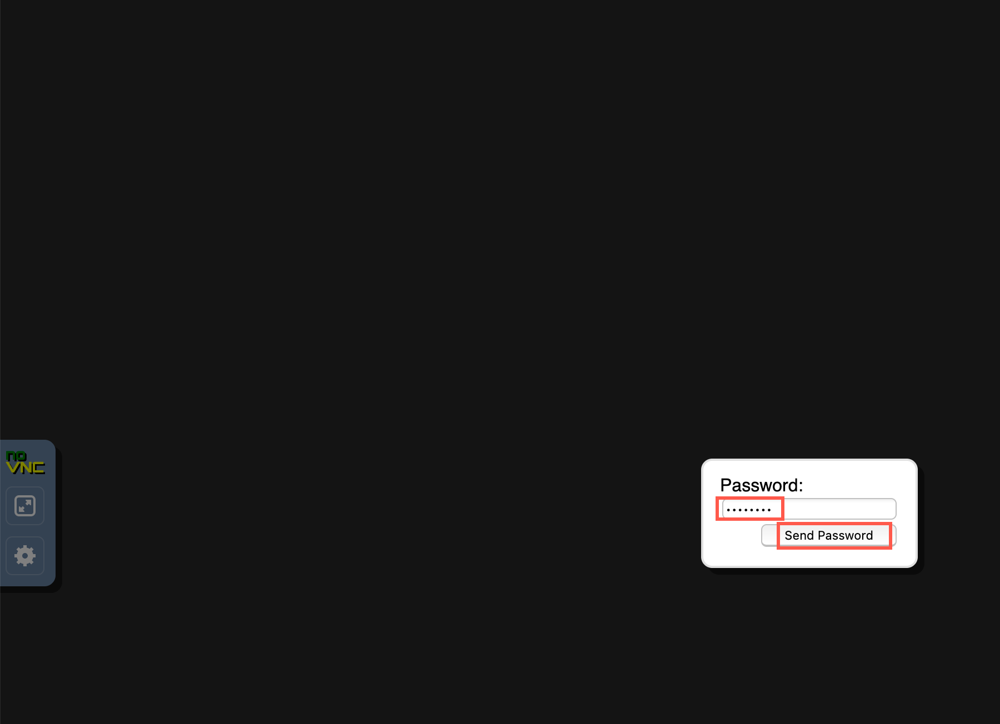
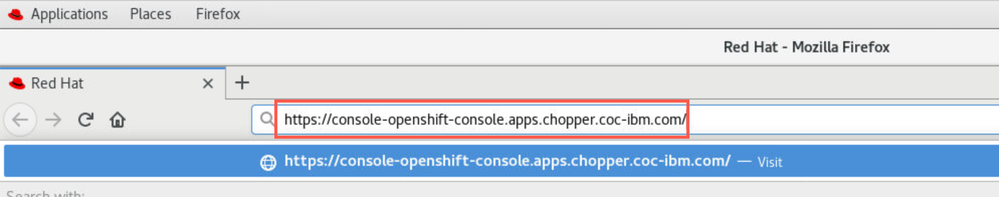
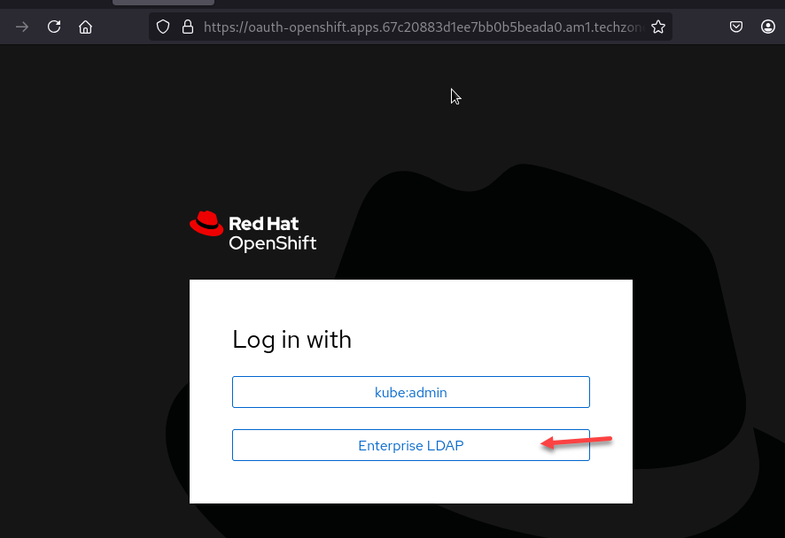
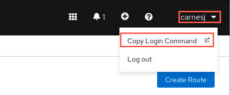

# Setup environment for MQ PoT

[Return to MQ lab page](../../index.md)

## Connect to your Virtual Desktop Image

1. As a PoT attendee you should have been provided with instructions to connect to a Virtual Desktop Instance which you will use to execute the labs in this PoT, including the details for connecting to you VDI.

	**Note**:If you did not receive an email for the PoT or your email did not include the following information, your instructor will provide the required information.

1. Copy your **VDI** URL in a browser.

1. The VNC window appears. Click connect.

	

1. Paste or enter the password included in the details then click *Send Password*.

	

1. The Linux desktop appears. You are now logged in as *student*. You'll notice the toolbar on the left. This is used to control the VNC settings. You will use it mostly for copy/paste from outside the VNC desktop. You can hide the toolbar by clicking the arrow on the side of the toolbar.

	

## Connect to the Red Hat OpenShift cluster

You have been also provided with the URL to connect to the Red Hat OpenShift cluster where you will execute the labs. You have also received a userid to use throughout the PoT. The userids are defined in an LDAP for the cluster.

The userid will also be the assigned name of a project (namespace) for you to work in. The project will be yours alone throughout the PoT. No one else will have access to your project and you will not have access to any other student's project.

1. From the information provided by the instructor, copy the URL for the OCP Console.

1. Paste the URL onto the clipboard of the VDI.

	

	Then copy/paste the URL into a browser tab and hit enter.

	

	If you receive a security warning, click *Advanced* then scroll down and click *Accept the Risk and Continue*.

	

	Repeat if challenged a second time.

1. Select **Enterprise LDAP**.

	

1. Sign in to the cluster with your ID and password. The sample used was *studen1*. Click *Log in*.

	

1. You could be presented with an introductory tour. If you are interested you can page through the short tips. Otherwise you can just click *Skip tour*.

	

1. If you have been logged into the *Developer* perspective, click the drop-down next to Developer and select *Administrator*.

	

1. You are now in the *Adminstrator* perspective and logged it with your assigned userid. Your project (namespace) is visible as well as *cp4i*, *cp4i-apic*, *cp4i-tracing*. You will only use your project (e.g *student5*) for this PoT.

	

	You will be in your assigned namespace. There are many other namespaces in OCP, but you will only be permitted to use yours so as not to affect the other users.

### Connect to the Red Hat OpenShift cluster thru *oc* command

1. In OCP console, click the drop-down next to your username and select "Copy Login Command".

	

	**Note**: In some cases you could be requested to log in again. Please introduce your usedid and password if needed.
1. A new browser tab opens. Click the *Display Token* hyperlink.

	

1. Copy the command under "Log in with this token".

	

1. Open a terminal window (Go to *Applications/Terminal*) and paste the command into the terminal and hit enter which logs you into the cluster.

	
	```
	oc login --toke=<token> --server=<server>
	```
1. Please review that you have been able to log in into the cluster. If *oc* command execution asks you to use insecure connections please answer "yes". Openshift cluster is presenting a self-signed certificated due this is a test environment.

  


<a name="download"></a>
## Download artifacts for MQ on CP4I PoT

You should be logged on your VDI as *ibmuser*.

1. Open a Firefox browser tab and navigate to [Github MQonCP4i](https://github.com/ibm-cloudintegration/mqoncp4i-2025).

	

1. Click *Code* and select *Download zip*.

	

1. Open a terminal window by clicking on the **Application** on top menu and under **Favorites** click the icon for **Terminal**.

	

1. Enter the following command to see the zip file you just downloaded.

	```
	cd Downloads
	```

1. Enter the following command to unzip the downloaded file:

	```
	unzip mqoncp4i-2025-main.zip
	```

	

1. Move the unzipped directory to your home directory with the following command:

	```
	cd mqoncp4i-2025-main
	```

	```
	mv MQonCP4I/ ~/
	```

	

	This will create the directory **/home/ibmuser/MQonCP4I**.  Change to your home directory and list the contents of the directory to verify that it contains *MQonCP4I*.

	```sh
	cd ~/MQonCP4I
	ls -l
	```
1. Now first we will need to update the setup.properties_template file with cluster info so that the scripts will be able to login to the correct clusters.
Enter the following command to edit file.

	```
	gedit setup.properties_template
	```

	

	1. Update *STORAGE_CLASS* with the primary cluster URL.  

	1. Update *OCP Cluster 1* with the primary cluster URL.  

		If you are going to do the MQ NativeHA CRR labs you will have a second cluster so update the *OCP Cluster 2* with that cluster URL.     

	1. 	Update the OCP CLUSTER USER and PASSWORD with the ones provide to you.  This will be the same for both clusters.

	1. Select **Save**   

1. Now we will need to change the mode to executable for all the scripts.  From the MQonCP4I directory run the following command.

	```
	find . -type f -iname "*.sh" -exec chmod +x {} \;
	```

1. Now we will run the script that will create all the install scripts for your userid.

	```
	./MQ_setup.sh -i 02 -n student2
	```  

	1. 	When you run the MQ_setup.sh You will use your student id that was given to you from the instructor.

		**Note:** In this example we are user student2 so would use that as the namespace and 02 as the student id.
	1. If will ask if this is correct.  enter **Y**

	


Great! You are now ready to start working in the MQ labs.

[Return to MQ lab page](../../index.md)
